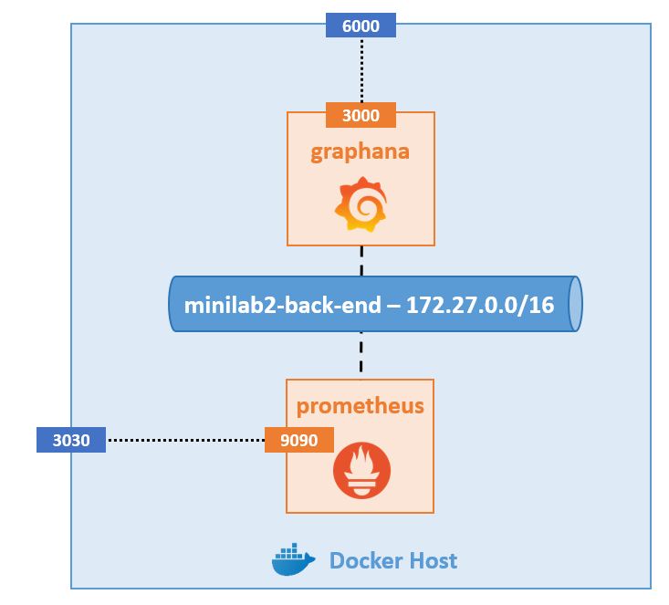

# Minilab 2 - Prometheus + Graphana

### Architecture

**Prometheus** est un outil de monitoring permettant de récupérer des metriques depuis des serveurs.

**Graphana** est un outil de visualisation souvent utilisé de paire avec Prometheus pour afficher des graphiques de monitoring.

Dans ce minilab, vous allez créer l'architecture suivante :

### Ressources

Crééez cette architecture à l'aide de la Docker CLI :

- Réseau
    - **Nom** - minilab2-backend
    - **Adresse de sous-réseau** - 172.27.0.0/16
    - **Driver** - bridge

- Prometheus
    - **Nom** - prometheus
    - **Image** - prom/prometheus
    - **Version de l'image** - latest
    - **Réseau** - minilab2-backend
    - **Données** - le fichier [prometheus.yml](./src/prometheus.yml) doit être présent dans le répertoire /etc/prometheus du conteneur
    - **Données** - le répertoire /prometheus du conteneur doit être persisté sur le Docker Host
    - **Port-mapping** - Port 3030 du Docker Host avec le port 9090 du conteneur

- Graphana
    - **Nom** - grafana
    - **Image** - grafana/grafana
    - **Version de l'image** - latest
    - **Valeur de la variable d'environnement GF_SECURITY_ADMIN_USER** - {choix-libre}
    - **Valeur de la variable d'environnement GF_SECURITY_ADMIN_PASSWORD** - {choix-libre}
    - **Réseau** - minilab2-backend
    - **Données** - le fichier [datasource.yml](./src/datasource.yml) doit être présent dans le répertoire /etc/grafana/provisioning/datasources du conteneur
    - **Port-mapping** - Port 6000 du Docker Host avec le port 3000 du conteneur

Vous pouvez utiliser des images custom pour les conteneurs si vous le souhaitez.

### Tests

- Accédez à Graphana via l'URL http://localhost:6000
- Connectez-vous en utilisant les informations de connexion renseignés lors de la création du conteneur
- Vous devriez observer un graphe du nombre de requêtes par secondes du moteur prometheus
- Vous pouvez également accéder à l'interface web de Prometheus via l'URL htp://localhost:3030